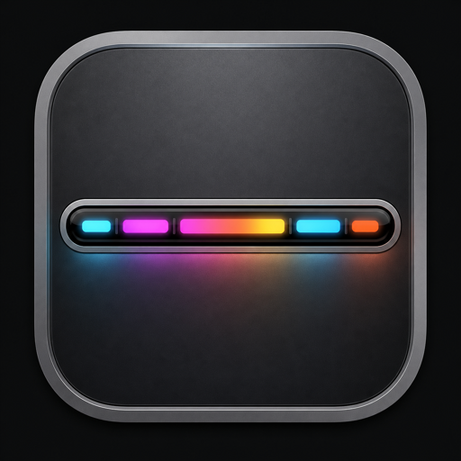

<p align="center">
  
</p>

# ToubarReplace

在桌面上镜像真实硬件 Touch Bar，并可选在物理 Touch Bar 上打开 Workspace，用触控直接选择项目路径、启动 Agent、打开常用 App。

> 需要一台**带 Touch Bar** 的 Intel Mac（macOS 14 及以上）。

---

## 安装

### 从安装包安装（推荐）

1. 打开发布包中的 **DMG**，或运行 **PKG** 安装程序。
2. 将 `ToubarReplace.app` 拖入「应用程序」文件夹（PKG 会自动安装到该位置）。
3. 首次打开：若系统提示来自未识别的开发者，可在「系统设置 → 隐私与安全性」中允许打开，或右键图标选择「打开」。
4. 启动后，菜单栏会出现 ToubarReplace 图标（本应用为菜单栏应用，Dock 中默认不常驻）。

### 首次使用可能需要的权限

| 权限 | 用途 |
|------|------|
| **自动化（Automation）** | 读取 Finder 当前目录；通过所选终端启动 Claude Code / Grok Build 等 |
| **辅助功能（Accessibility）** | 解析其他应用的文档路径（可选，增强路径识别） |

系统弹出权限请求时按提示允许即可。菜单栏 → **帮助…** 也可查看恢复与排错说明。

### 从源码构建（可选）

```sh
swift build
./.build/debug/ToubarReplace
```

打包为 `.app` / DMG / PKG：

```sh
TOUBAR_VERSION=1.2.3 Packaging/build-app.sh
```

产物在 `dist/` 目录。

---

## 功能概览

### 桌面镜像窗口

- 实时显示物理 Touch Bar 的画面（默认约 30 帧/秒，可在设置中调整）。
- 默认定在屏幕底部，可在设置中改为顶部、中央、上次关闭位置或自定义坐标。
- **点击穿透**：镜像窗为纯展示，鼠标点击会落到背后的应用；位置请用设置中的展示位置 / 自定义坐标调整，不能拖动窗口。
- 窗口出现在所有桌面空间。
- 有新画面时 100% 不透明；约 5 秒无更新时自动降至 30%（镜像与 Workspace 模式共用同一套逻辑）。
- **注意**：镜像窗口只负责显示，不把鼠标点击映射到物理 Touch Bar；触控操作请在物理栏上完成。

### Workspace（工作区）

通过切换按钮在物理 Touch Bar 上打开 Workspace，再次点击可返回系统 / 镜像模式：

- **切换方式**：默认使用可拖动的独立浮窗（短按切换，长按或拖动只改位置）；也可在设置中改为附着在镜像左侧或右侧。物理 Workspace 最左侧也有返回控件。
- **路径区**：Finder 在前台时优先显示当前 Finder 窗口目录；也可点路径区自行选择文件夹。
- **Agent 区**：本机已安装且可启动的工具会显示图标，一点即开，例如：
  - **Codex**
  - **Cursor**
  - **Claude Code**（在设置中选择终端，如 Otty 或 Terminal）
  - **Grok Build**
- **自定义 App**：最多固定 3 个常用 `.app`。空态点「自定义app」、有应用时点右侧齿轮，均打开**设置**进行新增 / 替换 / 移除；点图标仅打开该应用（不再静默 FIFO 挤掉）。

启动 Agent 成功后，默认约半秒自动返回镜像模式（可在设置中关闭）。

### 设置与菜单

菜单栏图标可打开：

- **设置…**：展示位置、镜像宽高、帧率、切换按钮位置、Claude Code 所用终端、启动 Agent 后是否自动返回、Workspace 自定义 App 管理等
- **帮助…**：使用说明与镜像异常时的恢复建议
- **退出 ToubarReplace**

打开设置时应用会暂时变为普通前台应用，关闭设置后回到菜单栏模式。

---

## 使用提示

1. **镜像异常 / 画面全黑或空白**  
   打开菜单栏 **帮助…** 查看说明。也可在终端依次执行：

   ```sh
   defaults delete com.apple.controlstrip FullCustomized
   defaults delete com.apple.controlstrip MiniCustomized
   killall ControlStrip
   ```

2. **锁屏或睡眠**  
   应用会暂停捕获；解锁或唤醒后自动恢复。

3. **「App 控制」或「快速操作」下暂时没有可显示内容**  
   镜像会保留最后一帧并给出提示；切换到支持触控栏的 App 或启用快速操作后会自动恢复。

